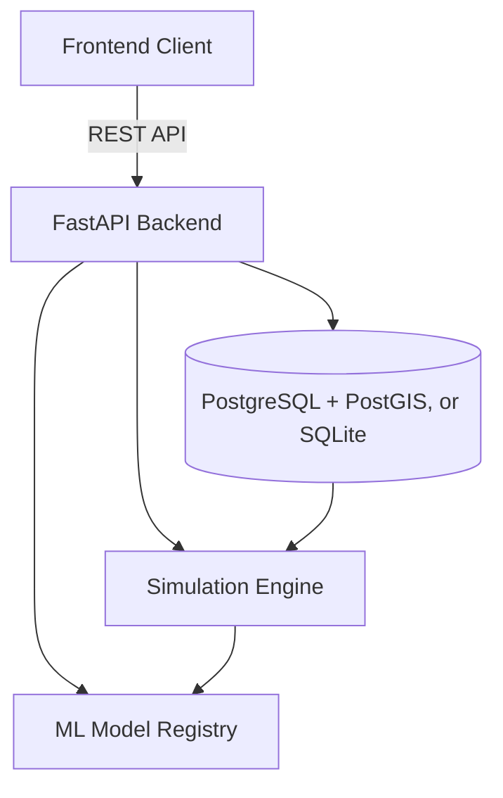

# BharatSim

BharatSim is an interactive platform for environmental and climate simulation across India. It brings together district level datasets, a modular simulation engine, and a map based interface so you can explore conditions such as flood risk, heat, air quality, and crop yield at the district level.

## Overview

The project has two parts. A Next.js frontend handles the map, dashboard, simulation screens, and assistant. A FastAPI backend serves district data, runs the simulation engine, and exposes a REST API. They communicate over HTTP, so the frontend can run on its own or connect to the backend for live data.

## Quick start (frontend only)

The frontend runs on its own with no backend, database, or API keys. It ships with an offline vector map of all 759 Indian districts, a dashboard, a working simulation form, and an assistant with built in responses.

```bash
cd frontend
npm install
npm run dev
```

Open http://localhost:3000 in your browser.

When you connect the backend or add credentials later, the same interface moves from sample data to live data without any code changes.

## Running the full stack

There are two ways to run the backend. Option A is the fastest and needs no Docker. Option B uses the full PostgreSQL and PostGIS setup.

### Option A: no Docker (recommended)

The backend runs on SQLite with a small set of dependencies. Docker, PostGIS, and the heavy machine learning packages are not required. This is enough to run the real API, database, and simulation engine.

```bash
# Backend. The backend/.env file is preset to SQLite and sample data.
cd backend
python -m venv venv
.\venv\Scripts\activate          # Windows. On macOS or Linux: source venv/bin/activate
pip install -r requirements-lite.txt
python -m app.seed               # loads the sample data into SQLite
uvicorn app.main:app --reload    # serves the API on http://localhost:8000

# Frontend, in a second terminal
cd frontend
npm install
npm run dev
```

Open http://localhost:3000. Interactive API documentation is available at http://localhost:8000/docs.

### Option B: PostgreSQL and PostGIS (Docker)

Use this if you want the spatial database and the full machine learning dependency set.

```bash
docker-compose up -d             # starts PostgreSQL, PostGIS, and Redis
cd backend
python -m venv venv && .\venv\Scripts\activate
pip install -e .                 # full dependencies, including the ML libraries
# In backend/.env, switch DATABASE_URL to the PostgreSQL URL. A commented example is provided.
python -m app.seed
uvicorn app.main:app --reload
```

## Data and API modes

BharatSim runs on bundled sample data by default. Supplying a credential switches the relevant feature to a live source, with no code changes.

| Capability | Default (sample or demo) | Live mode |
|---|---|---|
| Map basemap | Offline 759 district vector map | Set `NEXT_PUBLIC_MAPBOX_TOKEN` to use Mapbox GL |
| AI assistant | Built in responses | Set `OPENAI_API_KEY` to use live GPT answers |
| Weather data | Bundled sample CSVs in `data/sample/` | Set `USE_LIVE_DATA=true` for keyless Open-Meteo, or set `OPENWEATHER_API_KEY` |

Regenerate or extend the sample datasets at any time:

```bash
python data/generate_sample_data.py
```

## Deployment

BharatSim is designed to host with zero required API keys — every capability has a keyless sample/demo fallback (see "Data and API modes" below).

### Backend → Render

A ready-made blueprint ships at `render.yaml`. In the Render dashboard: **New → Blueprint**, select this repository, and click **Apply**. It builds `backend/` with `requirements-lite.txt` and serves the API on SQLite, reseeding the sample data on every boot — no Postgres or Docker needed. Note the resulting service URL (e.g. `https://bharatsim-backend.onrender.com`).

### Frontend → Vercel

Import this repository into Vercel and set:

- **Root Directory**: `frontend`
- **Environment Variable**: `NEXT_PUBLIC_API_URL` = your Render backend URL

Deploy to get a public URL for the app.

### Connect the two

The backend already allows any `*.vercel.app` origin (production and PR previews) automatically, so simulations work out of the box even before you touch `CORS_ORIGINS`. If you later attach a custom domain to the frontend, add it in Render as a plain value or comma-separated list:

```
CORS_ORIGINS=https://your-app.vercel.app,https://your-custom-domain.com
```

(A JSON array like `["https://your-app.vercel.app"]` also still works.)

Both platforms auto-redeploy on every push to `main`.

> Free-tier note: Render's free web services sleep after ~15 minutes of inactivity — the first request after a gap can take 20-50 seconds to wake up.

## Features

| Feature | Description |
|---|---|
| Interactive mapping | District level choropleth of all 759 districts. The map is a self contained vector map that needs no token, and it upgrades to Mapbox GL JS automatically when a token is provided. |
| Simulation engine | Modular design with adjustable parameters, for example rainfall multipliers or temperature offsets. |
| Analytics dashboard | Time series charts, a heatmap, and a ranking of districts by flood, air quality, or heat. |
| AI assistant | A chat interface that explains simulation results and environmental trends. |
| Sample or live data | Runs on bundled sample data, and switches to live sources when credentials are supplied. |

## Simulation and analytics

The simulation engine has four modules. Each one loads the relevant observations, applies a domain based model, and returns per district results with a severity level.

1. Flood Risk. Combines rainfall, river water levels, and soil saturation into a risk score.
2. Heatwave. Applies IMD style thresholds and a heat index calculation over the selected period.
3. Crop Yield. Estimates yield change from rainfall, temperature, irrigation, and fertilizer inputs.
4. Air Quality. Estimates an AQI from emissions, wind dispersion, and industrial and vehicle activity.

The repository also includes machine learning predictor modules and a model registry (XGBoost, LightGBM, scikit-learn, and PyTorch) that can back these domains once trained models are supplied.

## Architecture



## Technology stack

| Component | Technologies |
|---|---|
| Frontend | Next.js (App Router), TypeScript, Tailwind CSS 4, Recharts, Lucide icons, Mapbox GL JS (optional) |
| Backend | FastAPI, Python, SQLAlchemy, GeoAlchemy2 |
| Database | SQLite for local runs, or PostgreSQL with PostGIS and Redis for the full stack |
| Machine learning | XGBoost, LightGBM, scikit-learn, PyTorch, pandas |

## Project structure

| Path | Contents |
|---|---|
| `/frontend` | Next.js web application, map, dashboard, and assistant |
| `/backend` | FastAPI application, simulation modules, and data models |
| `/data` | Sample datasets, the data generator, and database initialization scripts |

## Testing

From the `backend` directory, run the test suite:

```bash
cd backend
pytest
```

## License

This project is licensed under the MIT License.
